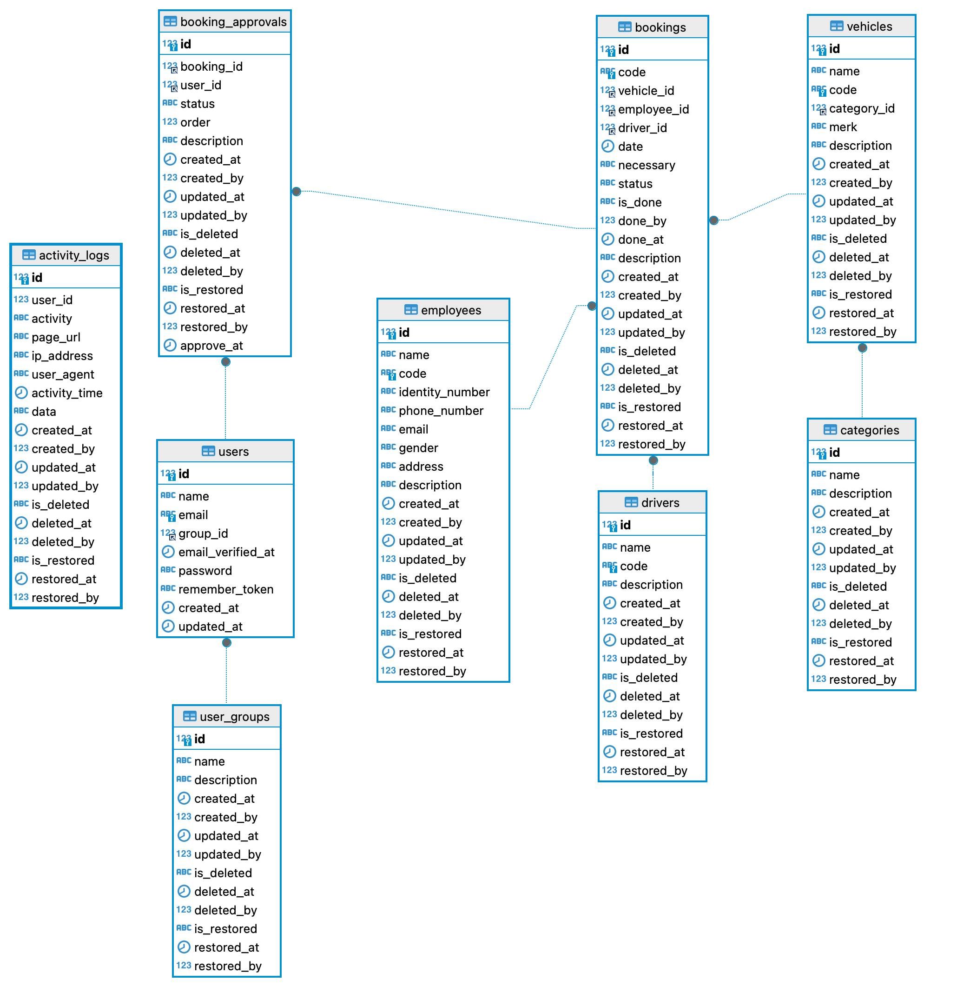
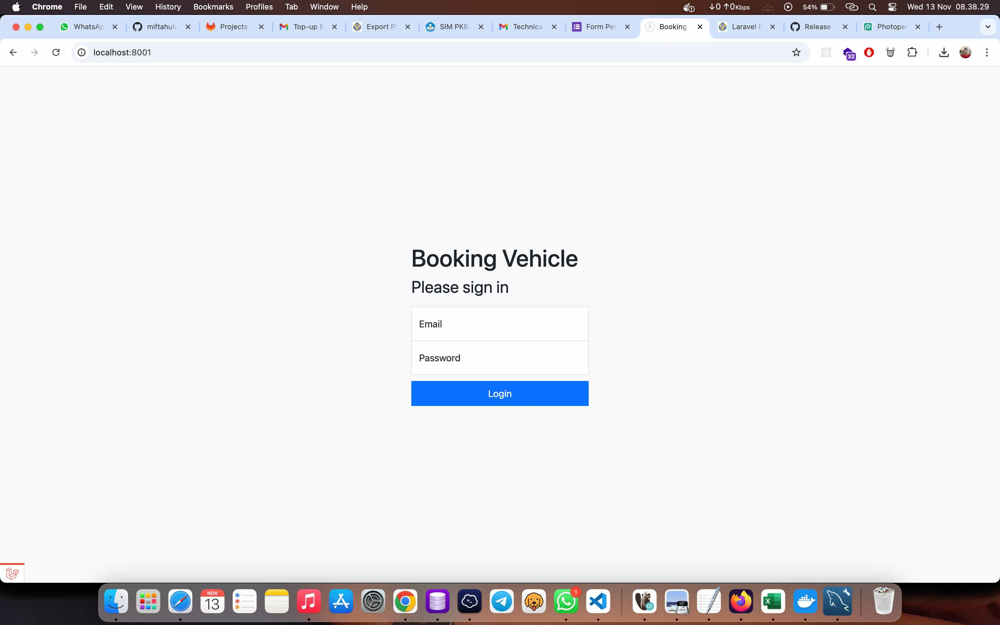
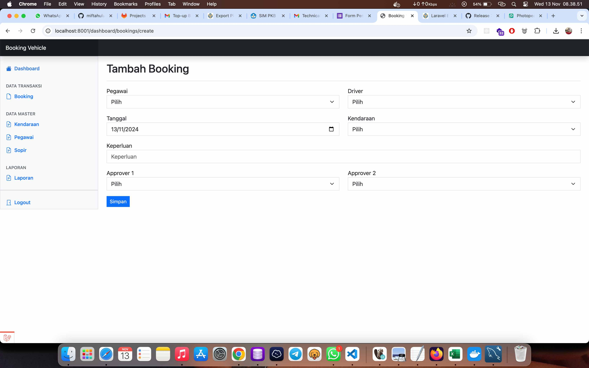
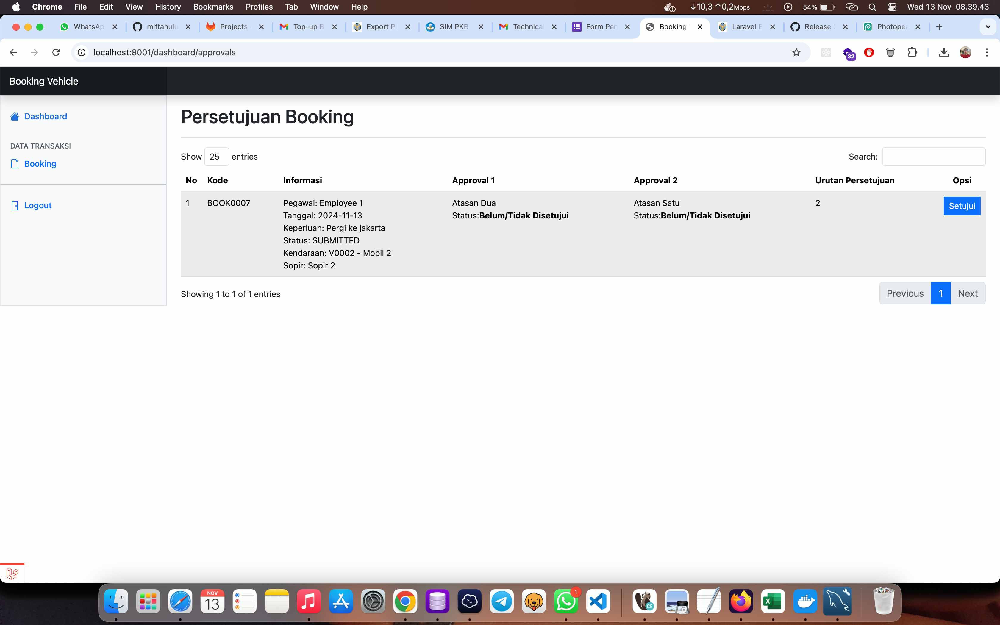
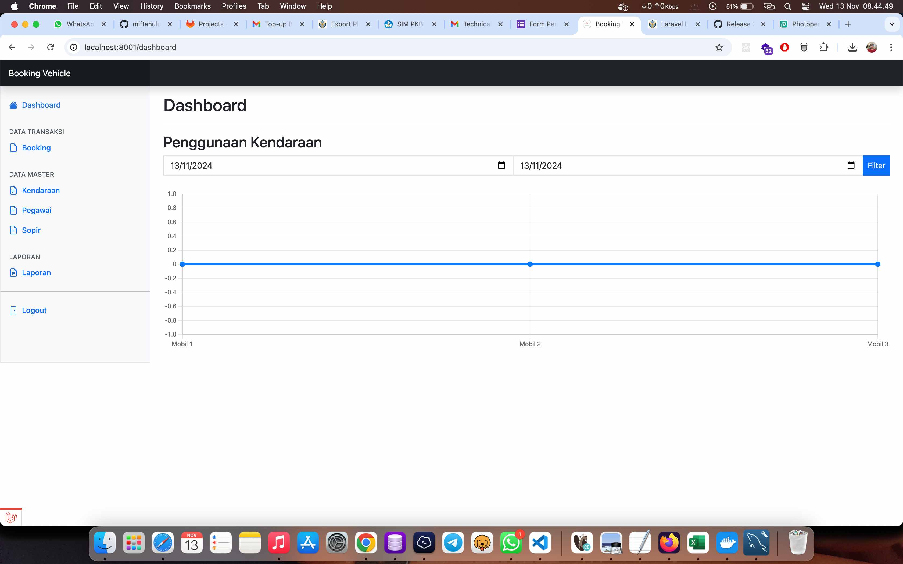
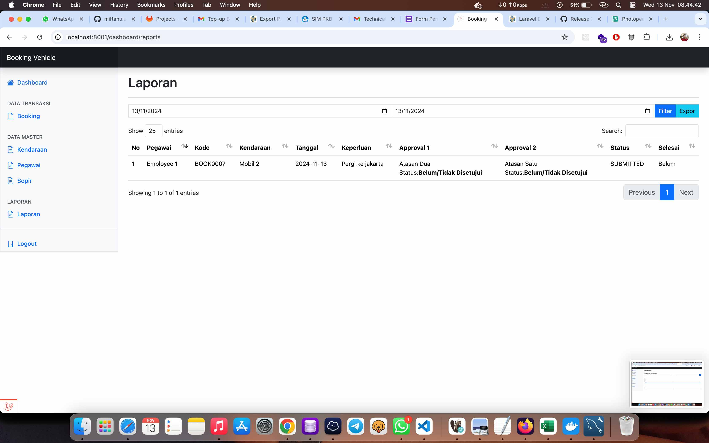

# booking-vehicle

## Getting started

Sistem pemesanan kendaraan dengan framework laravel versi 11. PHP versi 8.0. Database MySQL versi 8.<br/>
Sistem ini dikembangkan oleh <a href="https://miftahululum002.github.io/" target="_blank">Miftahul Ulum</a>. Anda dapat menghubungi saya melalui email <a href="mailto:ulumiftahul06@gmail.">ulumiftahul06@gmail.com</a>

## Langkah-langkah untuk menginstall aplikasi

<ol>
<li>Clone project ini dengan perintah

```
git clone https://github.com/miftahululum002/booking-vehicle.git
```

</li>
<li>Buka project pada VS Code</li>
<li>Buka terminal di VS Code</li>
<li>Install dependency dengan composer

```
composer install
```

</li>
<li>Buka terminal, duplikat konfigurasi .env

```
cp .env.example .env
```

</li>
<li>
Atur konfigurasi database credential pada file .env
</li>
<li>
Jalankan migration untuk membuat data dummy

```
php artisan migrate --seed
```

</li>
<li>
Generate key

```
php artisan key:generate
```

</li>
<li>
Jalankan server development

```
php artisan serve
```

</li>
</ol>

## Daftar Credential User

<ul>
<li>Admin<br/>
email: admin@mail.com <br/>
pass: password
</li>
<li>
Pihak Yang Menyetujui<br/>
email: approver1@mail.com <br/>
pass: password<br/>
<br/>
email: approver2@mail.com <br/>
pass: password<br/>

</li>
</ul>

## Host

Host: http://127.0.0.1:8000

## Data Model



## Cara Penggunaan Aplikasi

<ul>
<li>
Admin login<br/>
<br/><br/>
</li>

<li>
Admin input booking (pemesanan) mengisi form yang tersedia
<br/>
<br/><br/>
</li>
<li>Pihak yang menyetujui login</li>
<li>
Approver menyetujui booking (pemesanan) yang ada dilakukan dengan berjenjang
<br/>
<br/><br/>
</li>
<li>Admin dapat melakukan penyelesaian booking apabila sudah selesai</li>
<li>
Admin dapat melihat grafik penggunaan kendaraan
<br/>
<br/><br/>
</li>
<li>
Admin dapat melihat laporan dan mengekspor data dalam bentuk excel
<br/>
<br/><br/>
</li>
</ul>
